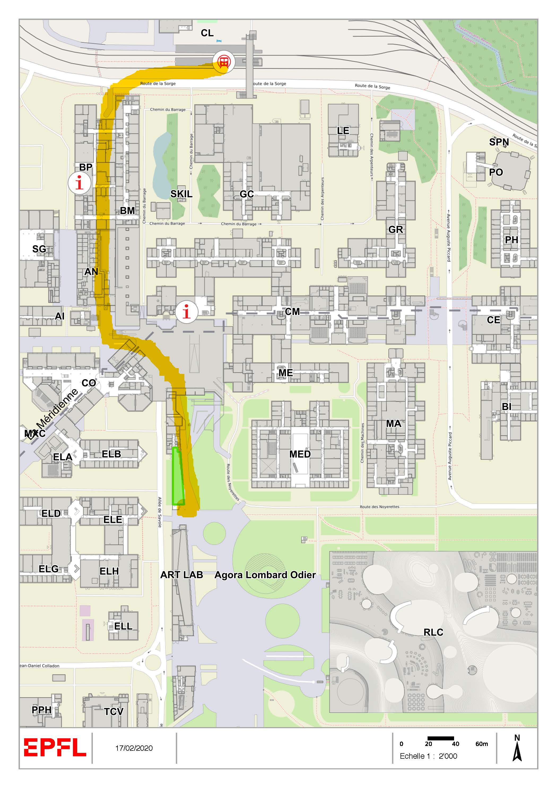

#### Address

EPFL Campus, Lausanne, Switzerland; Building **ARTLAB, Room [A0 100](https://plan.epfl.ch/?room==ART%20A0%20100).**

#### How to arrive on campus

We highly recommend to use **public transportation** (Metro M1, stop EPFL) to come to the event as it is by far the best way to get around in Lausanne.          

SBB [mobile app](https://www.sbb.ch/en/timetable/mobile-apps/sbb-mobile.html) and [website](https://www.sbb.ch/en/home.html) are very handy for finding the fastest way, and your destination will be ‘Ecublens VD, EPFL’ or just ‘EPFL’. SBB gives timeschedules for both trains and local metros.

- Arriving from Lausanne by train: take the train to Renens (10 min) and then take the Metro M1 which starts in the train station next to Track 1. It will take you to the EPFL stop (5 min).
- Arriving from Lausanne by metro from the lake:  take the Metro M2 (direction Epalinges, Croisette), stop at  Lausanne-Flon, change to the Metro M1 that will take you to the EPFL (total 25min).        
- Arriving from Lausanne by metro from the city center:  take Metro M1 that will take you to the EPFL stop (17min).

If you are by car, you will need to find a space in the ‘White places’ (aka. visitor parking spots). More details on parking can be found on this [page](https://www.epfl.ch/campus/mobility/vehicles/car-parks/white-places/), including a link to a map indicating the available lots.

Here is the walking path from EPFL metro strop to ArtLab:

#### How to arrive to Lausanne

If you arrives by plane, the easiest way from Geneva Airport is by train. The train station is located in the airport itself, and there are multi-lingual ticket machines and a ticket counter available.

#### Hotels

 EPFL receives preferential rates for the following hotels:

- [Starling hotel](https://starling-hotel-lausanne.com/), right next to the campus.

  CHF 160.- per room per night for a single occupation business room with breakfast and parking included (additional tourist tax CHF 3.50/day). Booking is to be done via this [link](https://reservations.starling-hotel-lausanne.com/73897?&_ga=2.29819964.2048408541.1581346080-784777331.1483273844#/accommodation/room) with the corporate code "EPFL1025".

- [SwissTech hotel](), right next to the campus, at the metro station.

  CHF 125.- per room per night for a single or double occupation business room *without* breakfast, which comes at an additional cost of CHF 14-. (additional tourist tax per day CHF 3.50). Booking is to be made via [email](mailto:sth@epfl.ch) or directly [online](http://www.swisstech-hotel.com/) with the code "Eldorado" <u>until March 10, 2020</u>.

- [Hotel des Voyageurs]([www.voyageurs.ch](http://www.voyageurs.ch/)), in Lausanne down-town.

  CHF 150.- / CHF 190.- per room per night for a single/double occupation, breakfast included (additional tourist tax CHF 3.50/day). Booking is to be made via [email](mailto:hotel@voyageurs.ch) with the code "ELDORADO" <u>until April 2, 2020</u>.

- [Hotel Au Lac](http://www.aulac.ch/), in Lausanne, directly at the lake.

  CHF 145.-/CHF 165.-per room per night for a single occupation business room with breakfast, *côté ville*/*côté lac* (additional tourist tax CHF 3.50/day). Booking is to be made via  [email](mailto:aulac@cdmgroup.ch), via phone ( +41 21 613 15 00), or via this [link]([www.aulac.ch](http://www.aulac.ch/)), with the code "Eldorado"  <u>until March 23, 2020</u>.

- [Hotel des Inventions](https://www.hotel-inventions.ch/en/), located 15min from the venue by direct bus.
  CHF 115.-/CHF 125.-per single/double room per night for a single occupation business room with breakfast (additional tourist tax CHF 3.50/day).  Booking is to be made via  [email](mailto:[booking@hotelinventions.ch](mailto:booking@hotelinventions.ch)), via phone ( +41 21 21 694 39 39) with the code "Eldorado" <u>until April 6, 2020</u>.

- [Lausanne Youth Hostel](https://www.youthhostel.ch/en/hostels/lausanne-jeunotel/), close to the lake, recently renovated, 20min from the venue by public transport. No preferential rates, single rooms between CHF 85.- and CHF 100.-, breakfast included.

#### Food

Impresso will be providing lunch on both days as well as dinner on the evening of April 23th.

​         
